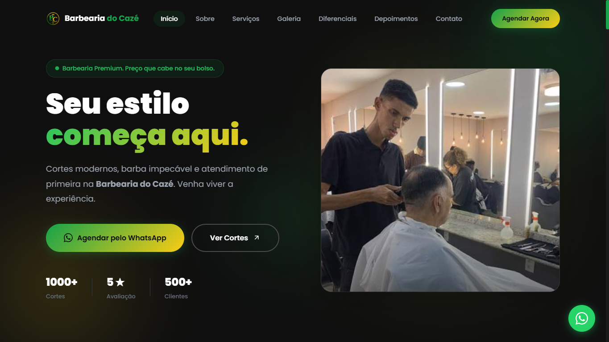

# 💈 Barbearia do Cazé

Landing Page desenvolvida para uma empresa fictícia do ramo de barbearia, criada com foco em design moderno, alta performance, responsividade e uma excelente experiência do usuário.

O projeto foi desenvolvido como parte do meu portfólio, simulando um site profissional para um negócio real.

---

## 📸 Preview



---

## 🚀 Demonstração

🔗 **Acesse o projeto online:**

https://ladingbarbeariacaze.vercel.app

---

## ✨ Funcionalidades

* ✅ Layout moderno e responsivo
* ✅ Design premium com identidade visual em verde e amarelo
* ✅ Navegação suave entre seções
* ✅ Menu fixo
* ✅ Animações durante a rolagem da página
* ✅ Galeria de cortes com Lightbox
* ✅ Carrossel de avaliações de clientes
* ✅ Seção de serviços
* ✅ FAQ interativo
* ✅ Botão para WhatsApp
* ✅ Otimização para dispositivos móveis
* ✅ Estrutura preparada para SEO

---

## 🛠️ Tecnologias utilizadas

* HTML5
* CSS3
* JavaScript

---

## 📁 Estrutura do projeto

```text
📦 Barbearia-do-Caze
├── assets/
│   ├── images/
│   ├── avatar-padrao.svg
│   ├── avatar.jpg
│   ├── bc-ogimage.png
│   ├── bcimage.jpg
│   ├── corte1.jpg
│   ├── corte2.jpg
│   ├── corte3.jpg
│   ├── corte4.jpg
│   ├── corte5.jpg
│   ├── corte6.jpg
│   ├── images2.jpg
│   └── sobre-barbearia.jpg
│   ├── icons/
│   ├── favicon.png
│   ├── favicon16.png
│   ├── favicon32.png
│   └── favicon180.png
├── index.html
├── css/
│   ├── style.css
├── js/
│   ├── script.js
└── README.md
```

---

## 📱 Responsividade

O projeto foi desenvolvido para funcionar corretamente em diferentes tamanhos de tela:

* 💻 Desktop
* 💼 Notebook
* 📱 Smartphones
* 📲 Tablets

---

## 👨‍💻 Autor

Desenvolvido por **m4chado7**.

- @m4chado7.web em todas as redes sociais.
- github.com/m4chado7

Caso tenha interesse em um site profissional para o seu negócio, entre em contato.